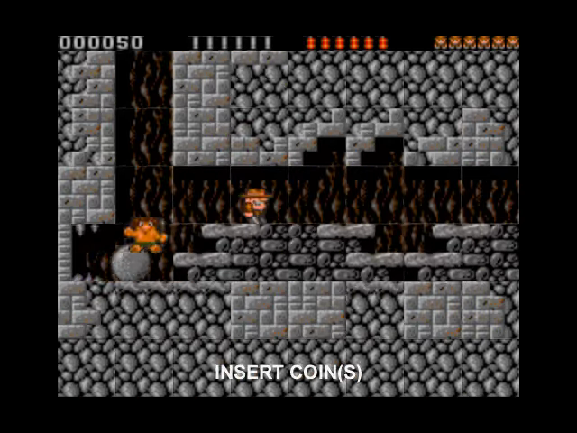
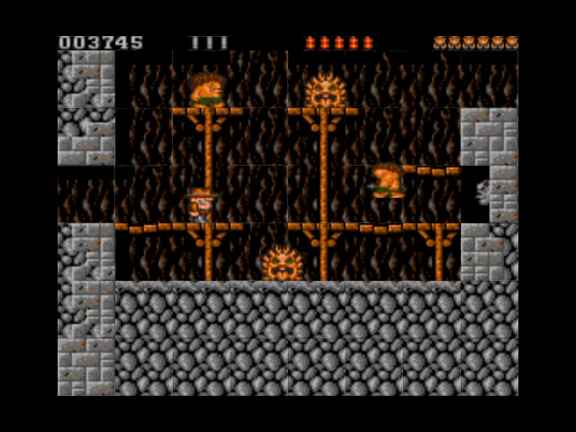
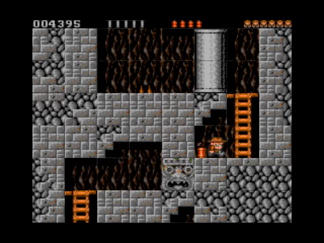
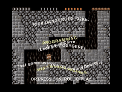

# Rick32 Go

A native Go/Ebitengine conversion of Leonard/Oxygene’s **Rick Dangerous — 32Kb revenge** (2002). It contains the nine rooms of the South American level, the original tiles and sprites, recorded attract-mode inputs, animated text pages and YM music.

Gameplay follows the original 25 Hz clock. Rendering and text animation run at 60 Hz. Demo Construction Kit v1.0.13 supplies cached sprite atlases, batched drawing, bitmap-font layout, per-character deformation, YM playback and synchronized video capture. The game engine is written entirely in Go.

```sh
go run .
```

The game starts in attract mode, with its recorded route and animated credits. Press **Control**, **Space** or **Enter** to play. Arrow keys move Rick; **Control + Up** fires a bullet and **Control + Down** places a bomb. **Up** jumps or climbs; **Down** crouches or climbs down.

| Key | Action |
| --- | --- |
| F | Switch linear/nearest texture filtering |
| W | Show geometry outlines |
| P | Pause/resume |
| R | Reset to attract mode |
| D | Return to attract mode |
| M | Mute/unmute |
| F1 | Toggle fullscreen |
| Escape | Return to attract mode, or quit from attract mode |

`go run . -mute` disables sound; `-fullscreen` starts fullscreen.

<!-- Project showcase -->
## Screenshots

[](docs/media/screenshot-1.png)

Rick and a rolling boulder in a stone chamber.

[](docs/media/screenshot-2.png)

Rick crosses platforms among temple enemies.

[](docs/media/screenshot-3.png)

Rick navigates ladders and traps in another chamber.

## Video

[](https://github.com/olivierh59500/go-rick32/raw/refs/heads/main/docs/media/preview.mp4)

**[Watch or download the 18-second MP4 preview with sound](https://github.com/olivierh59500/go-rick32/raw/refs/heads/main/docs/media/preview.mp4)**

This short showcase combines selected passages from the Go production.

Attract-mode gameplay includes the original animated credit overlay.

The animated image is silent; the MP4 includes the soundtrack.

<!-- End project showcase -->

## Android

```sh
./scripts/run-android.sh
```

Add `--build-only` to compile without installing. The ARM64 APK is generated at `android/app/build/outputs/apk/debug/app-debug.apk`. The landscape interface provides an eight-way virtual joystick, Fire, Play, Demo, Pause, Filter, Wire and Reset. Drag the circular thumb control to move or select a diagonal; its center dead zone is neutral, and releasing it stops movement. The stick keeps the same finger while dragging outside its base, so the other thumb can hold Fire. Combine Fire with an upward or downward stick direction to shoot or place a bomb. The app keeps the screen awake and follows the Android pause/resume lifecycle.

## Android release

`./scripts/build-release-android.sh` rebuilds the pinned Go library and produces
a signed ARM64 release in `.local/release/`, without installing an application.
It uses `~/.android-keys/malakh-release.p12` and alias `malakh-release` by default;
`--keystore` and `--alias` select another signing identity. The signing tool asks
for the password in an interactive terminal. `--password-file` can instead name
a private local file containing only that password. Keys/passwords are never
written to project sources or command-line arguments.

`--unsigned-only` builds and validates an aligned release for inspection without
opening the keystore. Unsigned outputs must not be distributed. The signed APK
is verified before replacing the preceding output; its SHA-256 file accompanies
the release. Keep the same application ID and signing key for future updates,
and increment the native Android version code. The current package is ARM64 only.

## Video

```sh
go run ./cmd/video -output recordings/rick32.mp4
```

The default recording lasts three minutes at 640 × 480 and 60 frames/s. DCK captures the game canvas and its YM soundtrack together. `-duration` and `-poster-at` select the recording length and PNG thumbnail time.

## Verification and credits

`go test ./...` checks the compact native data, all nine rooms, jumping/reset, and the 2,272-step recorded route against positions, animation frames and player flags obtained by running the original x86 routines. The gameplay ending and final score also match that recording. These checks cover the simulation independently of the graphics backend.

[Data formats](reference/FORMAT.md) describe the native tables. [Rendering and audio](reference/RENDERING.md) cover the Ebitengine/DCK composition.

Rick Dangerous was created by Core Design. Rick32 was programmed by Arnaud Carré (Leonard/Oxygene), using the XRick gameplay work of Stéphane (Bigorno) Gay. Music is by Jochen Hippel. The original artwork and in-game credits are retained.
